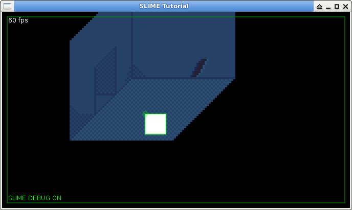
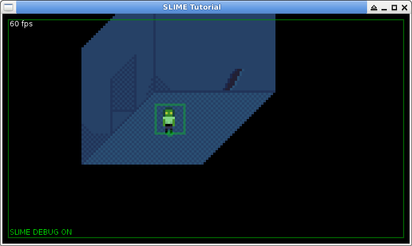
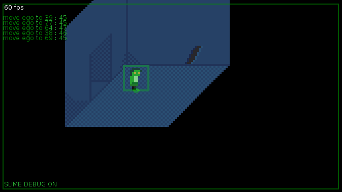
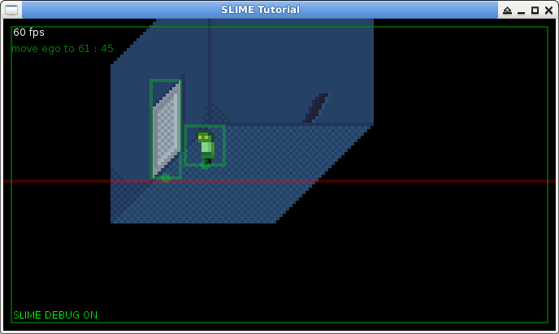
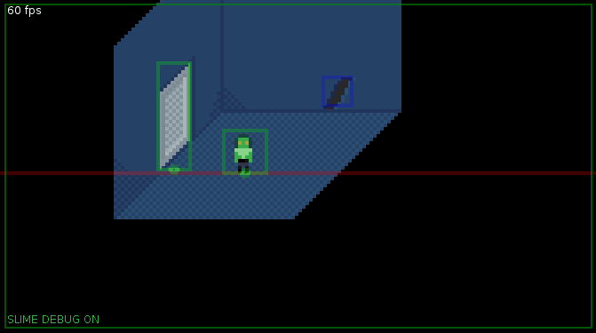
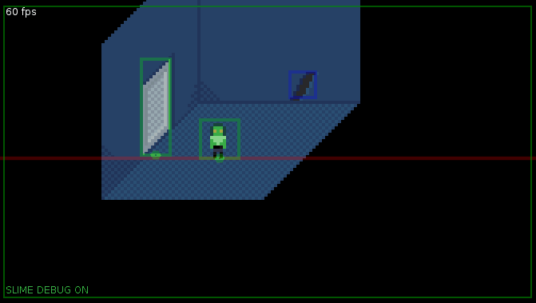
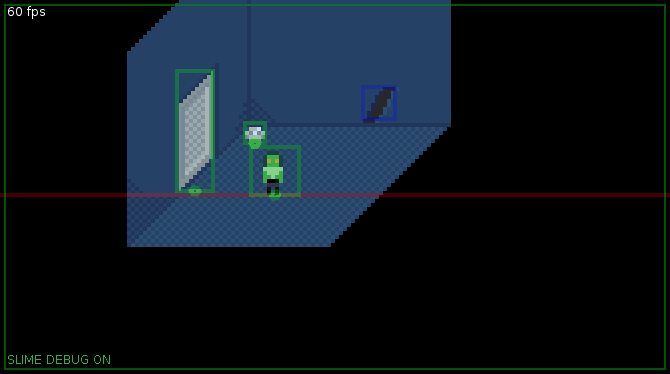

# SLIME tutorial

In this tutorial we will make a point-and-click adventure with L&Ouml;VE and the SLIME library. Keep the [SLIME API reference](http://wesleywerner.github.io/loveslime/) handy.

> To make a proper method call, use obj:method() which is 'syntactical sugar' for obj.method(obj)

## Set up your game

To start we create our game directory and copy the `slime` library into the directory. We also touch the files `main.lua`and `conf.lua`.

    .
    |-- main.lua
    |-- conf.lua
    '-- slime/

Leading by example, here is the starting code:

**main.lua**  

    slime = require ("slime")

    function love.load()
        -- Do not anti-alias our pixel graphics
        love.graphics.setDefaultFilter("nearest", "nearest", 1)
    end

    function love.draw()
        slime:draw()
        slime:debugdraw()
    end

    function love.update(dt)
        slime:update(dt)
    end

    function love.keypressed(key, isrepeat)
        if key == "escape" then
            love.event.quit()
        end
    end

**conf.lua**  

    function love.conf(t)
        t.window.title = "SLIME Tutorial"
        t.window.width = 170
        t.window.height = 96
    end

That gets you up and running. The main calls are `slime:update` and `slime:draw`, while the auxillary `slime:debugdraw` call is recommended while creating your game - It prints a useful overlay detailing events and borders around stage elements.

## Drawing bigger

Our pixel art is small and we will tell L&Ouml;VE to scale it up for us when drawing to the screen. By setting the `setDefaultFilter` to "nearest", the scaled pixels won't alias and blur into each other.

Let us scale our drawing up 4 times. We use a global `scale` for convenient re-use:

**conf.lua**  

    function love.conf(t)
        scale = 4
        t.window.title = "SLIME Tutorial"
        t.window.width = 170 * scale
        t.window.height = 96 * scale
    end

We tell L&Ouml;VE to scale itself using the `graphics.scale` function. SLIME also takes a scale value to match:

**main.lua**  

    function love.draw()
        love.graphics.push()
        love.graphics.scale(scale)
        slime:draw(scale)
        love.graphics.pop()
        slime:debugdraw()
    end

## First Stage

We work with "stages" in SLIME - A stage has a background and actors. I recommend you organize your stages as easy-to-manage functions.  

I will use the pixel art I drew for my Ludum Dare #33 entry. Take a look:

Background:  

And this is how we use them:

    function setupStage ()
        slime:reset()
        slime:background("images/cell-background.png")
        local ego = slime:actor("ego")
        ego.x = 70
        ego.y = 50
    end

    function love.load()
        ...
        setupStage()
    end
    
When we run this in L&Ouml;VE we see our background and a white sprite where our actor "Ego" stand. Ego has no animations set yet so she displays with a placeholder. 

Notice how the actor is outlined green. This is SLIME's debug drawing making life easier for you.

## Animating Actors

Animations are handled with the [anim8 library created by kikito](https://github.com/kikito/anim8). It is a great addition to L&Ouml;VE and I heartily thank you kikito! This quote from the **anim8 page** explains the frames format:

* Each two numbers are interpreted as quad coordinates. This way, grid:getFrames(3,4) will return the frame in column 3, row 4 of the grid. There can be more than just two: grid:getFrames(1,1, 1,2, 1,3) will return the frames in {1,1}, {1,2} and {1,3} respectively.
* Using numbers for long rows is tedious - so grids also accept strings. The previous row of 3 elements, for example, can be also expressed like this: grid:getFrames(1,'1-3') . Again, there can be more than one string (grid:getFrames(1,'1-3', '2-4',3)) and it's also possible to combine them with numbers (grid:getFrames(1,4, 1,'1-3'))

Because actors will likely appear in multiple stages in our game, it is good to create them as reusable functions. 

This is our actor sprite sheet:  

We create a function that takes a position and creates the actor with animations. We can reuse this function throughout our game:

    function addEgoActor (x, y)

        -- Add an actor named "ego"
        local ego = slime:actor("ego")
        
        -- Position the actor
        ego.x = x
        ego.y = y
        
        -- The time between actor steps. More delay means slower steps.
        ego.movedelay = 0.05

        -- Set the actor's idle animation parameters.
        -- The idle animation plays when the actor is not walking or talking.
        -- This is a simple two-frame animation: Open eyes, then a blink every 3 seconds.
        -- If we do not give East facing frames, the West frame will be
        -- flipped for us automatically. So let us take advantage of that.
        
        local tileWidth = 12
        local tileHeight = 12
        local southFrames = {'11-10', 1}
        local southDelays = {3, 0.2}
        local westFrames = {'3-2', 1}
        local westDelays = {3, 0.2}
        local northFrames = {18, 1}
        local northDelays = 1
        local eastFrames = nil
        local eastDelays = nil        
        slime:idleAnimation (
            "ego", "images/ego.png",
            tileWidth, tileHeight,
            southFrames, southDelays,
            westFrames, westDelays,
            northFrames, northDelays,
            eastFrames, eastDelays )

        -- Walk animation
        local southFrames = {'11-14', 1}
        local southDelays = 0.2
        local westFrames = {'6-3', 1}
        local westDelays = 0.2
        local northFrames = {'18-21', 1}
        local northDelays = 0.2
        slime:walkAnimation (
            "ego", "images/ego.png",
            tileWidth, tileHeight,
            southFrames, southDelays,
            westFrames, westDelays,
            northFrames, northDelays,
            eastFrames, eastDelays )
            
        -- Talk animation
        local southFrames = {'15-17', 1}
        local southDelays = 0.2
        local westFrames = {'7-9', 1}
        local westDelays = 0.2
        local northFrames = {'15-17', 1}
        local northDelays = 0.2
        slime:talkAnimation (
            "ego", "images/ego.png",
            tileWidth, tileHeight,
            southFrames, southDelays,
            westFrames, westDelays,
            northFrames, northDelays,
            eastFrames, eastDelays )

    end

I included the walk and talk animations too. If these are not given, the actor will draw with a placeholder when walking or talking.

Now we simply call this to create Ego:

    addEgoActor (70, 50)

Congrats! You now have an actor on stage.

## Moving Actors

To move actors on the stage we must tell SLIME which portions are walkable. We do this with a mask image. Black is solid, any other color is walkable:

Floor mask (defines walkable areas):  
  

We update up stage setup function:

    function setupStage ()
        ...
        slime:floor("images/cell-floor-open.png")

Then we have to hook into L&Ouml;VE's mouse callback so when the player clicks, we tell SLIME to move Ego:

    -- Left clicking moves our Ego actor, and interacts with objects.
    function love.mousepressed(x, y, button)

        -- Adjust for scale
        x = math.floor(x / scale)
        y = math.floor(y / scale)

        -- Left mouse button
        if button == "l" then
            slime:moveActor ("ego", x, y)
        end
        
    end

Notice, _and this is important_, we adjust `x` and `y` by our scale. Because we scaled up X4, the window is 4 times larger than our actual pixel art, so we must compensate. 

Go ahead and click around to move Ego. You can even click outside walkable areas, Ego will move to the closest possible point. You get path finding and directional movement out the box. Just like magic.

## Behind the scenes

When Ego walks to the doorway she needs to walk behind the wall.  

We accomplish this with layers. We use the original background image, a layer mask, and the baseline (Y-position) of the layer.

Layer mask (defines walk-behind areas):  

We update our stage setup function:  

    function setupStage ()
        ...
        slime:layer("images/cell-background.png", "images/cell-layer.png", 50)
        
We need to give the background image because the layer is a cut-out from the background, the mask defines where to cut. And the baseline `50` means that if any actor is behind (under) `50` pixels, it is behind the layer.

Now we can move Ego behind the wall. More magic. Notice how SLIME draws the layer's baseline as a red horizontal line.

## Adding a door

Let's add a door to the stage and prevent Ego from walking out. The door slides up and down to open and close.

Following the "actor as a function" approach:

    function addCellDoor (x, y)

        -- Add the door as an actor
        local cellDoor = slime:actor("door")
        cellDoor.x = x
        cellDoor.y = y

        -- Sprite size and frames
        local frameWidth, frameHeight = 9, 30
        local animationDelay = 0.05
        -- A single frame that shows the door as open or closed
        local closedFrame = {1, 1}
        local openFrame = {31, 1}
        -- A series of frames that open or close the door
        local openingFrames = {"1-31", 1}
        local closingFrames = {"31-1", 1}

        -- Add the animations. Both the closing and opening have callbacks set.
        slime:addAnimation ("door", "closing", 
            "images/cell-door.png", frameWidth, frameHeight, 
            closingFrames, animationDelay)
        slime:addAnimation ("door", "closed", 
            "images/cell-door.png", frameWidth, frameHeight, 
            closedFrame, animationDelay)
        slime:addAnimation ("door", "opening", 
            "images/cell-door.png", frameWidth, frameHeight, 
            openingFrames, animationDelay)
        slime:addAnimation ("door", "open", 
            "images/cell-door.png", frameWidth, frameHeight, 
            openFrame, animationDelay)
        
        -- Start off closed
        slime:setAnimation ("door", "closed")

    end

    function openCellDoor ()

        slime:setAnimation ("door", "opening")
        slime:floor("images/cell-floor-open.png")

    end

    function closeCellDoor ()

        slime:setAnimation ("door", "closing")
        slime:floor("images/cell-floor-closed.png")

    end

    function slime.animationLooped (actor, key, counter)
    
        if actor == "door" then
            
            -- Keep the door closed after the closing animation played.
            if key == "closing" then
                slime:setAnimation ("door", "closed")
            end
            
            -- Keep the door open after the opening animation played.
            if key == "opening" then
                slime:setAnimation ("door", "open")
            end
            
        end
        
    end

If you noticed in the `addCellDoor` function, we do not use the the "idle" or "walk" animations. We add custom animations using `addAnimation`, and then we set the starting animation (albeit a single framed one) with `slime:setAnimation ("door", "closed")`.

To prevent the door animations from looping, we hook into the `slime.animationLooped` callback, and set the door to the single-framed open or closed animations.

Finally, I added two helper functions `closeCellDoor` and `openCellDoor` to easily set the door animation and toggle the floor mask so that actors can walk out. We will use these functions very soon.

   

Here is our updated stage setup:

    function setupStage ()

        -- Clear the stage
        slime:reset()

        -- Add the background
        slime:background("images/cell-background.png")
        
        -- Apply the walk-behind layer
        slime:layer("images/cell-background.png", "images/cell-layer.png", 50)
        
        -- Set the floor
        slime:floor("images/cell-floor-closed.png")
        
        -- Add our main actor
        addEgoActor (70, 50)
        
        -- Add the cell door
        addCellDoor(50, 49)
        
    end

## Hotspots

A hotspot is a region on the stage that the player can interact with. We create a new hotspot for the hole in the wall, when the player interacts we make Ego say something.

    function setupStage ()
        ...
        local x, y, width, height = 92, 23, 8, 8
        slime:hotspot ("hole", x, y, width, height)
    end

To make Ego say something when the player interacts (clicks) on the hole, we call `slime:interact` in `mousepressed`:

    function love.mousepressed(x, y, button)
        ...
        if button == "l" then
            slime:moveActor ("ego", x, y)
            slime:interact (x, y)
        end
    end

And we must subscribe to SLIME notifications:

    function myStageCallback (event, object)
        if (event == "interact") then
            if (object.name == "hole") then
                slime:addSpeech ("ego", "I see a hole in the wall")
            end
        end
    end

    function setupStage ()
        ..
        slime.callback = myStageCallback
    end

The `callback` is how we get notified when actors move or the player interacts with things on the stage. To keep our code neat we create a callback function for every stage in our game, this one is `myStageCallback`. When we set up our stage we assign `slime.callback = myStageCallback`. 

Ego moves and talks at the same time, not quite the effect we want. We want Ego to move first, then talk. Remove the `interact` call from `love.mousepressed` and add it to `myStageCallback`:

    function myStageCallback (event, object)
        if (event == "moved" and object.name == "ego") then
            slime:interact (object.clickedX, object.clickedY)
        end
        if (event == "interact") then
            if (object.name == "hole") then
                slime:addSpeech ("ego", "I see a hole in the wall")
            end
        end
    end

`object.clickedX` provides the point where Ego was told to go (or get as close as possible as the floor allows). When done moving we can interact at `clickedX` and `clickedY`.

## Bags

Bags are used to store inventory items.

Let's add a "bowl and spoon" actor to the stage, when the player clicks on the bowl, move Ego towards it and put it in a bag. 
    
    function setupStage ()
        ..
        local bowl = slime:actor("bowl and spoon")
        slime:addImage ("bowl and spoon", "images/bowl1.png")
        bowl.x = 65
        bowl.y = 37
    end

    function myStageCallback (event, object)
        ...
        if (event == "interact") then
            if (object.name == "bowl and spoon") then
                slime:turnActor ("ego", "south")
                slime:bagInsert ("ego", { ["name"] = "bowl", ["image"] = "images/bowl2.png" })
                slime:bagInsert ("ego", { ["name"] = "spoon", ["image"] = "images/spoon.png" })
                -- Remove the bowl and spoon actor from the stage
                slime:actors["bowl and spoon"] = nil
            end
            ...

A couple new functions pop up here, we have `turnActor` which faces Ego south (so the actor's back isn't facing the player when picking up the bowl), `bagInsert` which stores items in the bag named "ego", and we remove the bowl actor from the stage.

You will see the SLIME debug log says "Added bowl to bag ego". This is the first step to carrying items in your game!

## Display Bag Contents

Each game differs how inventory is displayed, and all that control is in your hands. All you need to know is:

* The `slime:bagContents("ego")` function gets you the contents of the "ego" bag.
* The `slime.inventoryChanged (bag)` callback notifies you when a bag contents has changed.
* The `slime:bagButton ( )` function adds an interactive hotspot for bag items.

Hold on to your socks!

    -- (global variable) Clicks below this point skip actor movement
    bagPosition = 86

    function slime.inventoryChanged ( )
        slime.bagButtons = { }
        for counter, item in pairs(slime:bagContents("ego")) do
            slime:bagButton (item.name, item.image, counter * 10, bagPosition)
        end
    end

And skip actor movement if the mouse was clicked in the "bag" zone:

    function love.mousepressed(x, y, button)
        ...
        if (y > bagPosition) then 
            slime:interact (x, y)
        else
            -- Move Ego then interact with any objects
            slime:moveActor ("ego", x, y)
        end

Nice work, Ego! 

But what just happened? 

1. On the `inventoryChanged` callback we clear and add `bagButtons`. Where you position these is up to you.
2. SLIME draws the buttons for us.
3. `slime.callback` notifies us with an "interact" event when the player clicks on a button. Just like a hotspot.

## Using inventory items on hotspots

Now that we receive the interact event for the spoon object in `slime.callback`, we can tell slime to wield the inventory item as a cursor.

    function slime.callback (event, object)
        ...

        -- Set the cursor when interacting on bag items
        if (object.name == "spoon") then
            slime:setCursor (object.name, object.image, scale, 0, 0)
        end
    end
    
This changes the mouse cursor to the spoon image. What is more, any time after after you call `slime:interact (x, y)`, instead of the "interact" event you will get a "spoon" event, along with the object clicked on.

    slime.callback (event, object)
        -- event is the cursor name
        if (event == "spoon" and object.name == "door") then
            slime:addSpeech ("ego", "The spoon won't open this door")
        end
    end

Call `slime:setCursor()` with no arguments to use the default cursor.

# TODO

Tutorial sections still in progress

* Adding NPCs
* A dialogue example

